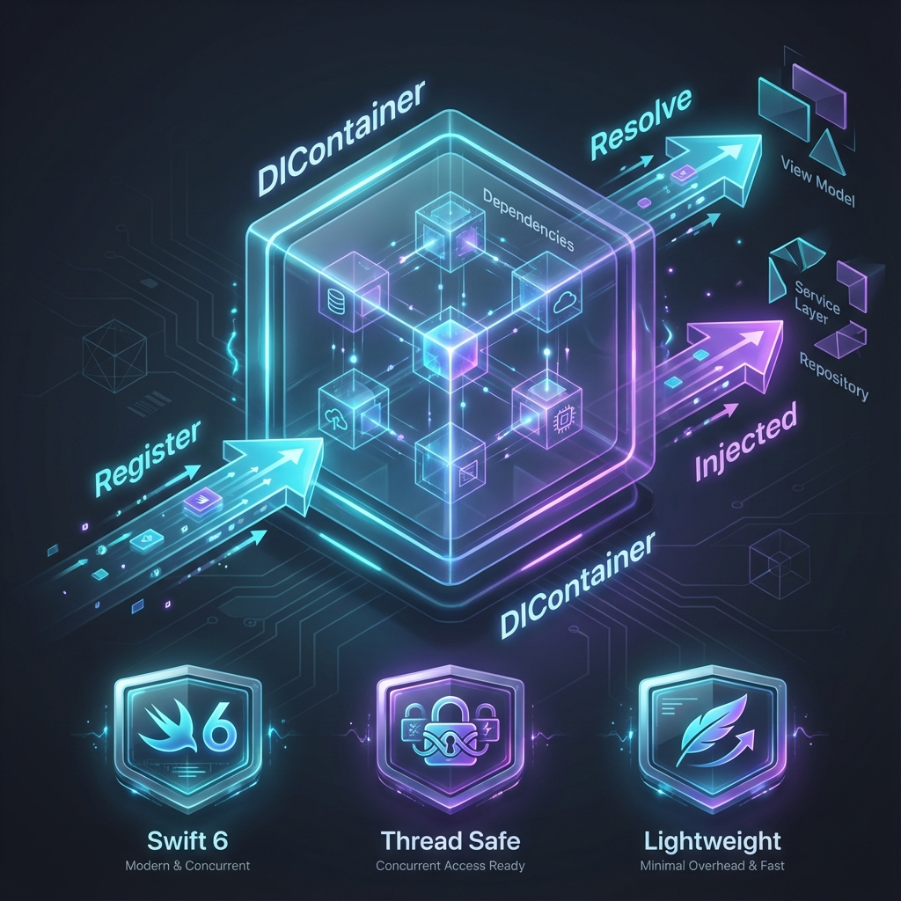

[](https://github.com/Tavernari/DIContainer/actions/workflows/swift.yml) [](https://github.com/Tavernari/DIContainer/actions)


# 🏺 DIContainer Swift

A lightweight, thread-safe dependency injection container for Swift, designed to be simple, intuitive, and boilerplate-free.

**Now fully compatible with Swift 6 and strict concurrency!** 🚀

## Features

- **Ultra-lightweight**: Minimal footprint and overhead.
- **Thread-Safe**: Uses `NSRecursiveLock` and `@unchecked Sendable` to guarantee safety across concurrently executing tasks.
- **Swift 6 Ready**: Fully supports strict concurrency checking.
- **Simple API**: Register and resolve dependencies with ease.
- **Property Wrappers**: elegant injection using `@Injected` and `@InjectedSafe`.

## Concepts

### What is Dependency Injection?

> The intent behind dependency injection is to achieve separation of concerns of construction and use of objects. This can increase readability and code reuse.

### What is a DI Container?

> An IoC Container (a.k.a. DI Container) is a framework for implementing automatic dependency injection. It manages object creation and its lifetime, and also injects dependencies into the class.

## Installation

### Swift Package Manager

Add `DIContainer` as a dependency in your `Package.swift`:

```swift
dependencies: [
    .package(url: "https://github.com/Tavernari/DIContainer.git", from: "0.4.0")
],
targets: [
    .target(
        name: "MyProject",
        dependencies: ["DIContainer"]
    )
]
```

## Usage

### Registering Dependencies

You can register dependencies using a key, a type, or a mix of both.

```swift
// Register by key
Container.standard.register(key: "api_key") { _ in "123456" }

// Register by type
Container.standard.register(type: NetworkService.self) { _ in NetworkService() }

// Register by type with a key (for multiple implementations)
Container.standard.register(type: Storage.self, key: "cache") { _ in CacheStorage() }
Container.standard.register(type: Storage.self, key: "disk") { _ in DiskStorage() }
```

#### Using Convenience Extensions (Recommended)

Define type-safe identifiers for your dependencies:

```swift
extension InjectIdentifier {
    static var githubService: InjectIdentifier<FetchService> { .by(type: FetchService.self, key: "github") }
    static var config: InjectIdentifier<AppConfig> { .by(type: AppConfig.self) }
}

// Register using extension
Container.standard.register(.githubService) { _ in GitHubService() }
Container.standard.register(.config) { _ in AppConfig.shared }
```

### Resolving Dependencies

You can resolve dependencies directly from the container or using property wrappers.

#### Direct Resolution

```swift
let service = try? Container.standard.resolve(.githubService)
```

#### Property Wrappers

Use `@Injected` for mandatory dependencies (crashes if missing) and `@InjectedSafe` for optional ones.

```swift
class MyViewModel {
    // Crashes if not found!
    @Injected(.githubService)
    var service: FetchService
    
    // Provide a default value
    @Injected(.config, default: AppConfig.default)
    var config: AppConfig
    
    // Optional, nil if not found
    @InjectedSafe(.by(key: "analytics"))
    var analytics: AnalyticsService?
}
```

## Thread Safety & Swift 6

This library is designed to work safely in concurrent environments. The `Container` is `Sendable` and protects its internal storage with a recursive lock, allowing you to register and resolve dependencies from any thread without race conditions.

```swift
// Safe to use in concurrently executing code
Task {
    let service = try? Container.standard.resolve(.githubService)
    await service?.fetchData()
}
```
